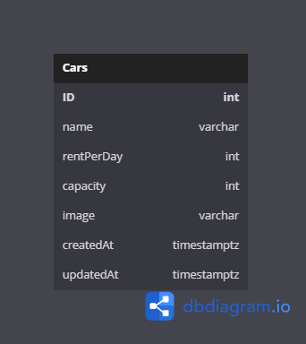

# CHALLENGE 05

## Diagram


## GET /api/cars/

Response: 

```json
[
  {
    "id": 1,
    "name": "mobil A",
    "rentPerDay": 300000,
    "capacity": 3,
    "image": "https://res.cloudinary.com/dcwzbmyjw/image/upload/v1669367221/cars/irt45ydfk3joetmkchah.jpg",
    "createdAt": "2022-11-25T09:07:02.511Z",
    "updatedAt": "2022-11-25T09:07:02.511Z"
  },
  {
    "id": 3,
    "name": "mobil B",
    "rentPerDay": 250000,
    "capacity": 5,
    "image": "https://res.cloudinary.com/dcwzbmyjw/image/upload/v1669369173/cars/juiogxqycoxd0ju4zlqk.jpg",
    "createdAt": "2022-11-25T09:39:34.177Z",
    "updatedAt": "2022-11-25T09:39:34.177Z"
  },
  {
    "id": 4,
    "name": "mobil C",
    "rentPerDay": 400000,
    "capacity": 5,
    "image": "https://res.cloudinary.com/dcwzbmyjw/image/upload/v1669369203/cars/qxozdpsaf135hayrives.jpg",
    "createdAt": "2022-11-25T09:40:04.444Z",
    "updatedAt": "2022-11-25T09:40:04.444Z"
  }
]
```

## POST /api/cars/

Response: 

```json
{
  "name": "mobil D",
  "image": "https://res.cloudinary.com/dcwzbmyjw/image/upload/v1669369892/cars/gquivvrwth9dywwlgczd.jpg",
  "rentPerDay": "900000",
  "capacity": "10"
}

```

## PUT /api/cars/:id | (id = 1)

Response: 

```json
{
  "name": "mobil Z",
  "rentPerDay": "1000000",
  "capacity": "2",
  "image": "https://res.cloudinary.com/dcwzbmyjw/image/upload/v1669369988/cars/kgahavo0uoxplhxmvokz.jpg"
}

```

## PATCH /api/cars/:id | (id = 4)

Response: 

```json
{
  "name": "mobil X",
  "rentPerDay": "300000",
  "image": "https://res.cloudinary.com/dcwzbmyjw/image/upload/v1669370122/cars/lsypid3nolxu69xtjeoc.jpg"
}

```

## DELETE /api/cars/:id | (id = 5)

Response: 

```json
Success deleting car.

```

## FINAL RESULT (GET ALL)


```json
[
  {
    "id": 3,
    "name": "mobil B",
    "rentPerDay": 250000,
    "capacity": 5,
    "image": "https://res.cloudinary.com/dcwzbmyjw/image/upload/v1669369173/cars/juiogxqycoxd0ju4zlqk.jpg",
    "createdAt": "2022-11-25T09:39:34.177Z",
    "updatedAt": "2022-11-25T09:39:34.177Z"
  },
  {
    "id": 1,
    "name": "mobil Z",
    "rentPerDay": 1000000,
    "capacity": 2,
    "image": "https://res.cloudinary.com/dcwzbmyjw/image/upload/v1669369988/cars/kgahavo0uoxplhxmvokz.jpg",
    "createdAt": "2022-11-25T09:07:02.511Z",
    "updatedAt": "2022-11-25T09:53:09.050Z"
  },
  {
    "id": 4,
    "name": "mobil X",
    "rentPerDay": 300000,
    "capacity": 5,
    "image": "https://res.cloudinary.com/dcwzbmyjw/image/upload/v1669370122/cars/lsypid3nolxu69xtjeoc.jpg",
    "createdAt": "2022-11-25T09:40:04.444Z",
    "updatedAt": "2022-11-25T09:55:23.016Z"
  }
]

```